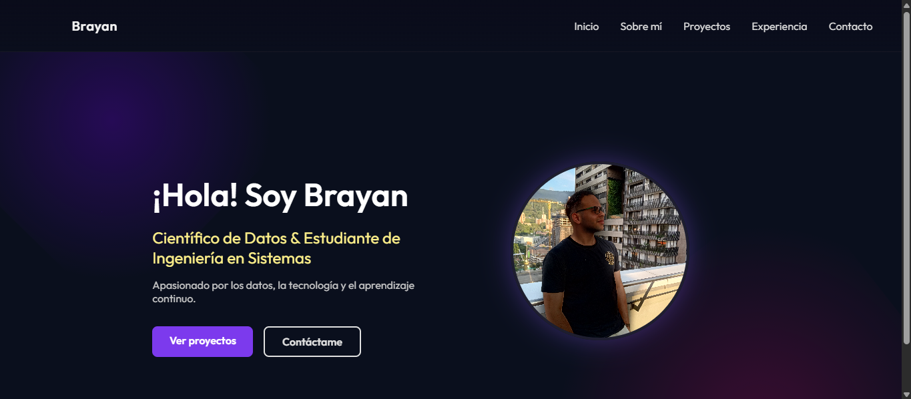

# 🌐 Portafolio Personal - Brayan Gómez

¡Hola! 👋 Soy **Brayan Gómez**, Científico de Datos y estudiante de Ingeniería en Sistemas apasionado por los datos, la tecnología y el aprendizaje continuo.

Este proyecto es mi portafolio personal, desarrollado con **React** y **CSS personalizado**, donde presento mis habilidades, proyectos, experiencia y medios de contacto.

---

## 🚀 Tecnologías utilizadas

- ⚛️ React.js
- 🎨 CSS clásico (sin frameworks)
- 💻 HTML5
- 🧠 Diseño responsivo

---

## 🎯 Secciones del portafolio

- **Inicio**: Bienvenida y presentación.
- **Sobre mí**: Quién soy y qué me inspira.
- **Proyectos**: Mis trabajos destacados.
- **Habilidades**: Herramientas y tecnologías que manejo.
- **Contacto**: Formulario y enlaces útiles.

---

## 📷 Vista previa

> Puedes ver una muestra del portafolio aquí:




---

## ⚙️ Cómo ejecutar localmente

```bash
# Clona el repositorio
git clone https://github.com/tuusuario/mi-portafolio.git
cd mi-portafolio

# Instala las dependencias
npm install

# Inicia la aplicación
npm start
```

---

## 🌐 Enlace al portafolio

[👉 Ver en línea ](https://portafolio-sigma-ecru.vercel.app/)

---

## 📬 Contacto

- Email: brayan6264@gmail.com
- LinkedIn: [linkedin.com/in/brayan-gomez-backend](www.linkedin.com/in/brayan-gomez-backend)
- GitHub: [github.com/brayan6264](http://github.com/brayan6264)

---

> Hecho con ❤️, dedicación y café ☕ por **Brayan Gómez**